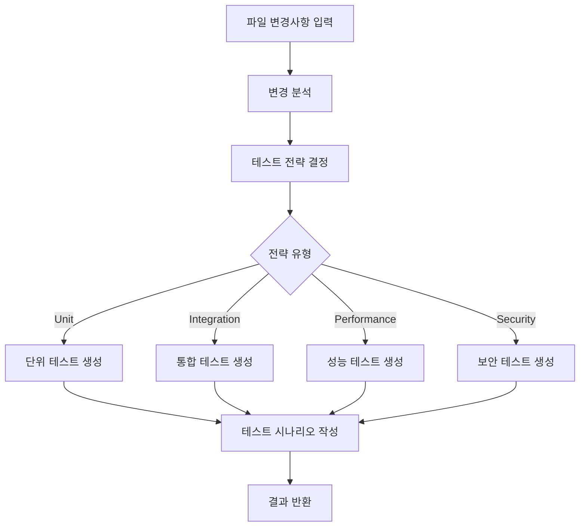

# LLM Agent 모듈 문서

> AI 기반 테스트 생성의 핵심 엔진

## 📌 개요

LLM Agent는 Azure OpenAI Service를 활용하여 **코드 변경사항을 분석하고 자동으로 테스트 코드와 시나리오를 생성**하는 핵심 모듈입니다. LangChain 프레임워크를 기반으로 구현되어 있으며, 복잡한 AI 워크플로우를 체계적으로 관리합니다.

## 🎯 주요 기능

### 1. 테스트 전략 결정
- 코드 변경 내용을 분석하여 적절한 테스트 유형 결정
- Unit Test, Integration Test, Performance Test, Security Test 등 분류
- 우선순위 및 의존성 분석

### 2. 테스트 코드 생성
- 변경된 코드에 대한 자동 테스트 코드 생성
- 프로그래밍 언어 및 테스트 프레임워크 자동 감지
- 엣지 케이스 및 예외 상황 처리 포함

### 3. 테스트 시나리오 작성
- 비즈니스 관점의 테스트 시나리오 생성
- 전제조건, 테스트 단계, 예상 결과 명세
- 엑셀 문서화를 위한 구조화된 형식

## 🏗️ 아키텍처

```
LLMAgent
├── Configuration
│   ├── Azure OpenAI Settings
│   ├── LangChain Setup
│   └── LangFuse Monitoring
├── Core Components
│   ├── Test Strategy Analyzer
│   ├── Code Generator
│   └── Scenario Builder
└── Output Handlers
    ├── TestCase Objects
    └── TestScenario Objects
```

## 💻 주요 클래스 및 데이터 모델

### TestStrategy (Enum)
```python
class TestStrategy(str, Enum):
    UNIT_TEST = "unit_test"
    INTEGRATION_TEST = "integration_test"
    PERFORMANCE_TEST = "performance_test"
    SECURITY_TEST = "security_test"
```
테스트 전략의 유형을 정의하는 열거형 클래스입니다.

### TestCase (Dataclass)
```python
@dataclass
class TestCase:
    name: str                    # 테스트 케이스 이름
    description: str             # 설명
    test_type: TestStrategy      # 테스트 유형
    code: str                   # 생성된 테스트 코드
    assertions: List[str]       # 검증 항목 목록
    dependencies: List[str]     # 의존성 목록
    priority: int              # 우선순위 (1-5)
```
생성된 테스트 케이스의 구조를 정의합니다.

### TestScenario (Dataclass)
```python
@dataclass
class TestScenario:
    scenario_id: str            # 시나리오 고유 ID
    feature: str                # 대상 기능
    description: str            # 시나리오 설명
    preconditions: List[str]    # 전제조건
    test_steps: List[Dict]      # 테스트 단계
    expected_results: List[str] # 예상 결과
    test_data: Optional[Dict]   # 테스트 데이터
    priority: str              # 우선순위 (High/Medium/Low)
    test_type: str             # 테스트 유형
```
테스트 시나리오의 구조를 정의합니다.

## 🔧 핵심 메서드

### `__init__(config: Config)`
- LLM Agent 초기화
- Azure OpenAI 클라이언트 설정
- LangFuse 모니터링 초기화

### `_initialize_llm()`
- Azure OpenAI LLM 인스턴스 생성
- 테스트 생성용 LLM: temperature=0.4, max_tokens=4000
- 분석용 LLM: temperature=0.7, max_tokens=2000

### `analyze_changes(file_changes: List[FileChange])`
- 파일 변경사항 분석
- 코드 패턴 및 복잡도 평가
- 테스트 필요성 및 범위 결정

### `determine_test_strategy(commit_analysis: CommitAnalysis)`
- 커밋 분석 결과를 바탕으로 테스트 전략 수립
- 변경 유형별 적절한 테스트 방법 선택
- 우선순위 및 실행 순서 결정

### `generate_test_code(strategy: TestStrategy, changes: List[FileChange])`
- 선택된 전략에 따른 테스트 코드 생성
- 프롬프트 엔지니어링을 통한 최적화
- 코드 품질 검증 및 리팩토링

### `generate_test_scenarios(test_cases: List[TestCase])`
- 테스트 케이스를 기반으로 시나리오 생성
- 비즈니스 관점의 테스트 명세 작성
- 문서화 형식으로 구조화

## 🔄 워크플로우



## 🎨 프롬프트 엔지니어링

### 프롬프트 구조
```yaml
system_prompt: |
  당신은 전문 테스트 엔지니어입니다.
  주어진 코드 변경사항을 분석하여 
  적절한 테스트를 생성해야 합니다.

user_prompt: |
  파일: {file_path}
  변경 유형: {change_type}
  변경 내용: {diff}
  
  위 변경사항에 대한 테스트 코드를 생성하세요.
```

### 프롬프트 최적화 전략
1. **컨텍스트 제공**: 프로젝트 구조 및 기존 테스트 패턴 포함
2. **예시 기반**: Few-shot learning으로 품질 향상
3. **제약 조건 명시**: 테스트 프레임워크, 코딩 컨벤션 지정
4. **출력 형식 정의**: JSON 스키마로 구조화된 응답 유도

## 📊 성능 및 모니터링

### LangFuse 통합
- 모든 LLM 호출 추적 및 로깅
- 토큰 사용량 및 비용 모니터링
- 응답 시간 및 성공률 측정
- 프롬프트 버전 관리

### 성능 지표
- **평균 생성 시간**: 5-10초/테스트 케이스
- **성공률**: 95% 이상
- **토큰 효율성**: 평균 2000 토큰/테스트

## 🔐 보안 고려사항

1. **API 키 관리**: 환경 변수를 통한 안전한 관리
2. **입력 검증**: 악의적인 코드 주입 방지
3. **출력 필터링**: 민감한 정보 노출 방지
4. **Rate Limiting**: API 호출 제한 관리

## 🛠️ 설정 및 사용법

### 환경 변수 설정
```bash
# Azure OpenAI
AZURE_OPENAI_ENDPOINT=https://your-endpoint.openai.azure.com/
AZURE_OPENAI_API_KEY=your-api-key
AZURE_OPENAI_DEPLOYMENT_NAME=gpt-4
AZURE_OPENAI_API_VERSION=2024-02-15-preview

# LangFuse (선택사항)
LANGFUSE_PUBLIC_KEY=your-public-key
LANGFUSE_SECRET_KEY=your-secret-key
LANGFUSE_HOST=https://cloud.langfuse.com
```

### 기본 사용 예제
```python
from ai_test_generator.core.llm_agent import LLMAgent
from ai_test_generator.utils.config import Config

# Agent 초기화
config = Config()
agent = LLMAgent(config)

# 테스트 생성
file_changes = [...]  # 변경된 파일 목록
test_cases = agent.generate_test_code(file_changes)
scenarios = agent.generate_test_scenarios(test_cases)
```

## 🔍 트러블슈팅

### 일반적인 문제 해결

#### 1. API 타임아웃
- **원인**: 복잡한 코드 또는 네트워크 지연
- **해결**: timeout 값 증가 또는 청크 단위 처리

#### 2. 낮은 품질의 테스트 생성
- **원인**: 불충분한 컨텍스트 또는 프롬프트
- **해결**: 프롬프트 개선 및 예시 추가

#### 3. 토큰 한도 초과
- **원인**: 너무 큰 입력 또는 출력
- **해결**: 파일 분할 처리 또는 max_tokens 조정

## 📈 개선 계획

### 단기 목표
- [ ] 다양한 프로그래밍 언어 템플릿 추가
- [ ] 테스트 품질 평가 메트릭 구현
- [ ] 캐싱 메커니즘 도입

### 장기 목표
- [ ] Fine-tuning된 모델 적용
- [ ] 자체 학습 시스템 구축
- [ ] 실시간 코드 리뷰 통합

## 📚 참고 자료

- [Azure OpenAI Documentation](https://learn.microsoft.com/azure/cognitive-services/openai/)
- [LangChain Documentation](https://python.langchain.com/)
- [LangFuse Documentation](https://langfuse.com/docs)
