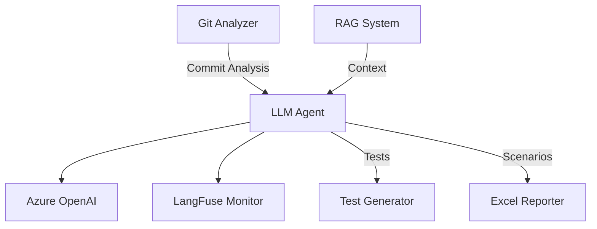
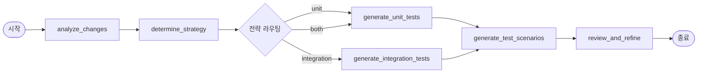

# LLM_Agent.py Module Documentation

## 목차
1. [개요](#개요)
2. [아키텍처](#아키텍처)
3. [주요 구성 요소](#주요-구성-요소)
4. [워크플로우](#워크플로우)

## 개요

LLM Agent는 AI Test Generator의 핵심 컴포넌트로, LangGraph를 활용한 상태 기반 워크플로우를 통해 테스트 생성을 관리합니다. Azure OpenAI Service와 연동하여 코드 변경사항을 분석하고 적절한 테스트 코드와 시나리오를 자동으로 생성합니다.

### 주요 특징
- **상태 기반 워크플로우**: LangGraph를 활용한 명확한 처리 흐름
- **다중 테스트 전략**: 단위, 통합, 성능, 보안 테스트 지원
- **언어별 최적화**: Python, Java, JavaScript 등 다양한 언어 지원
- **품질 보증**: 자동 검토 및 개선 제안
- **모니터링**: LangFuse 통합으로 실시간 성능 추적

## 아키텍처



## 주요 구성 요소

### 1. 데이터 모델

#### TestStrategy (Enum)
테스트 전략 타입을 정의하는 열거형입니다.

```python
class TestStrategy(str, Enum):
    UNIT_TEST = "unit_test"           # 단위 테스트
    INTEGRATION_TEST = "integration_test"  # 통합 테스트
    PERFORMANCE_TEST = "performance_test"  # 성능 테스트
    SECURITY_TEST = "security_test"       # 보안 테스트
```

#### TestCase
생성된 테스트 케이스의 정보를 담는 데이터 클래스입니다.

| 필드 | 타입 | 설명 |
|------|------|------|
| name | str | 테스트 이름 |
| description | str | 테스트 설명 |
| test_type | TestStrategy | 테스트 타입 |
| code | str | 테스트 코드 |
| assertions | List[str] | 검증 항목 |
| dependencies | List[str] | 의존성 목록 |
| priority | int | 우선순위 (1-5, 1이 최고) |

#### TestScenario
QA 문서화를 위한 테스트 시나리오 정보입니다.

| 필드 | 타입 | 설명 |
|------|------|------|
| scenario_id | str | 시나리오 고유 ID |
| feature | str | 기능/모듈명 |
| description | str | 시나리오 설명 |
| preconditions | List[str] | 전제 조건 |
| test_steps | List[Dict[str, str]] | 테스트 단계 |
| expected_results | List[str] | 예상 결과 |
| test_data | Optional[Dict[str, Any]] | 테스트 데이터 |
| priority | str | 우선순위 (High/Medium/Low) |
| test_type | str | 테스트 타입 |

#### AgentState
LangGraph 워크플로우의 상태를 관리하는 TypedDict입니다.

```python
class AgentState(TypedDict):
    messages: Annotated[List[Any], add_messages]  # 대화 히스토리
    file_changes: List[FileChange]                # 파일 변경사항
    commit_analysis: Optional[CommitAnalysis]     # 커밋 분석 결과
    test_strategy: Optional[TestStrategy]         # 선택된 전략
    generated_tests: List[TestCase]              # 생성된 테스트
    test_scenarios: List[TestScenario]           # 테스트 시나리오
    rag_context: Optional[str]                   # RAG 컨텍스트
    error: Optional[str]                         # 에러 메시지
    current_step: str                            # 현재 단계
```

### 2. LLMAgent 클래스

#### 초기화 메서드

##### `__init__(self, config: Config)`
LLMAgent를 초기화합니다.
- LLM 클라이언트 설정
- LangFuse 모니터링 초기화
- 워크플로우 그래프 구축

##### `_initialize_llm(self)`
Azure OpenAI LLM을 초기화합니다.
- **기본 LLM**: temperature 0.2 (일관된 테스트 생성)
- **분석 LLM**: temperature 0.7 (창의적인 분석)

##### `_build_graph(self)`
LangGraph 워크플로우를 구축합니다.

## 워크플로우

### 실행 흐름도



### 워크플로우 노드

#### 1. analyze_changes
코드 변경사항을 분석하여 테스트 전략 수립에 필요한 인사이트를 도출합니다.

**분석 항목:**
- 변경의 성격과 범위
- 시스템에 미치는 잠재적 영향
- 테스트가 필요한 위험 영역
- 권장 테스트 접근법

#### 2. determine_strategy
분석 결과를 바탕으로 적절한 테스트 전략을 결정합니다.

**고려 사항:**
- 파일 타입과 변경 내용
- 변경의 복잡도
- 영향받는 의존성
- 위험 수준

**출력 형식:**
```json
{
    "primary_strategy": "unit|integration|performance|security",
    "secondary_strategies": ["list", "of", "strategies"],
    "reasoning": "전략 선택 이유",
    "priority_areas": ["집중 영역"]
}
```

#### 3. generate_unit_tests
개별 함수와 클래스에 대한 단위 테스트를 생성합니다.

**특징:**
- 함수별 독립적인 테스트
- 언어별 적절한 테스트 프레임워크 사용
- 모의 객체(Mock) 활용
- 경계값 및 예외 케이스 포함

#### 4. generate_integration_tests
여러 컴포넌트 간의 상호작용을 검증하는 통합 테스트를 생성합니다.

**검증 항목:**
- 컴포넌트 간 상호작용
- 데이터 흐름
- API 계약
- 에러 전파
- 외부 서비스 통합

#### 5. generate_test_scenarios
QA 팀을 위한 상세한 테스트 시나리오를 생성합니다.

**포함 내용:**
- 고유 시나리오 ID
- 기능/모듈 설명
- 전제 조건
- 상세 테스트 단계
- 예상 결과
- 필요한 테스트 데이터

#### 6. review_and_refine
생성된 테스트의 품질을 검토하고 개선 사항을 제안합니다.

**검토 기준:**
- **완전성**: 모든 변경사항 커버 여부
- **품질**: 테스트 구조와 의미의 적절성
- **정확성**: 기능 검증의 올바름
- **모범 사례**: 테스트 컨벤션 준수
