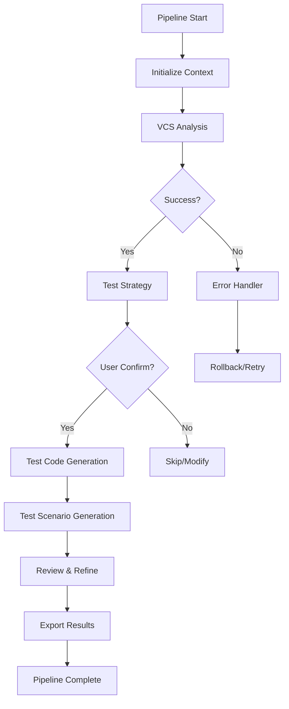

# Pipeline Stages 모듈 문서

> 단계별 프로세스 오케스트레이션 시스템

## 📌 개요

Pipeline Stages 모듈은 **테스트 생성 프로세스를 독립적이고 관리 가능한 단계로 분리**하여 실행하는 오케스트레이션 시스템입니다. 각 단계는 독립적으로 실행되며, 사용자가 진행 상황을 모니터링하고 필요시 개입할 수 있도록 설계되었습니다.

## 🎯 핵심 특징

### 1. 단계별 실행
- 각 단계가 독립적으로 실행 가능
- 중간 결과 저장 및 재시작 지원
- 단계별 검증 및 롤백 기능

### 2. 실시간 모니터링
- 진행률 추적 및 시각화
- 각 단계별 실행 시간 측정
- 오류 및 경고 실시간 알림

### 3. 유연한 워크플로우
- 단계 건너뛰기 및 재실행
- 조건부 실행 로직
- 사용자 확인 체크포인트

## 🏗️ 아키텍처

```
PipelineOrchestrator
├── Stage Management
│   ├── Stage Registry
│   ├── Execution Engine
│   └── State Manager
├── Pipeline Stages
│   ├── VCS Analysis Stage
│   ├── Test Strategy Stage
│   ├── Test Code Generation Stage
│   ├── Test Scenario Generation Stage
│   └── Review Generation Stage
└── Context & Results
    ├── Pipeline Context
    ├── Stage Results
    └── Callbacks
```

## 📊 파이프라인 단계

### 1. VCS Analysis Stage
**목적**: 버전 관리 시스템의 변경사항 분석

```python
class VCSAnalysisStage(BaseStage):
    """VCS 분석 단계"""
    
    주요 기능:
    - Git/SVN 저장소 분석
    - 커밋 변경사항 추출
    - 파일별 변경 내용 분류
    - 영향도 분석
```

**입력**:
- Repository path
- Selected commits

**출력**:
- Combined changes analysis
- File change statistics
- Commit metadata

### 2. Test Strategy Stage
**목적**: AI 기반 테스트 전략 수립

```python
class TestStrategyStage(BaseStage):
    """테스트 전략 결정 단계"""
    
    주요 기능:
    - 변경 패턴 분석
    - 적절한 테스트 유형 결정
    - 우선순위 설정
    - 의존성 파악
```

**입력**:
- VCS analysis results
- Project configuration

**출력**:
- Test strategies list
- Priority matrix
- Dependency graph

### 3. Test Code Generation Stage
**목적**: 실제 테스트 코드 생성

```python
class TestCodeGenerationStage(BaseStage):
    """테스트 코드 생성 단계"""
    
    주요 기능:
    - 언어별 테스트 코드 생성
    - 프레임워크 자동 감지
    - 어서션 로직 구성
    - 테스트 데이터 생성
```

**입력**:
- Test strategies
- File changes
- Code context

**출력**:
- Generated test code
- Test cases list
- Coverage metrics

### 4. Test Scenario Generation Stage
**목적**: 비즈니스 테스트 시나리오 작성

```python
class TestScenarioGenerationStage(BaseStage):
    """테스트 시나리오 생성 단계"""
    
    주요 기능:
    - 시나리오 문서화
    - 단계별 명세 작성
    - 예상 결과 정의
    - 테스트 데이터 명세
```

**입력**:
- Test cases
- Business context

**출력**:
- Test scenarios
- Documentation
- Excel templates

### 5. Review Generation Stage
**목적**: 생성된 결과물 검토 및 정제

```python
class ReviewGenerationStage(BaseStage):
    """리뷰 및 정제 단계"""
    
    주요 기능:
    - 품질 검증
    - 일관성 체크
    - 최적화 제안
    - 최종 문서 생성
```

**입력**:
- All previous results

**출력**:
- Final test suite
- Quality report
- Recommendations

## 💻 주요 클래스 및 데이터 모델

### StageStatus (Enum)
```python
class StageStatus(str, Enum):
    PENDING = "pending"       # 대기 중
    RUNNING = "running"       # 실행 중
    COMPLETED = "completed"   # 완료
    FAILED = "failed"        # 실패
    SKIPPED = "skipped"      # 건너뜀
```

### StageResult (Dataclass)
```python
@dataclass
class StageResult:
    stage: PipelineStage           # 단계 식별자
    status: StageStatus            # 실행 상태
    data: Dict[str, Any]          # 결과 데이터
    errors: List[str]             # 오류 목록
    warnings: List[str]           # 경고 목록
    execution_time: float         # 실행 시간
    metadata: Dict[str, Any]      # 메타데이터
```

### PipelineContext (Dataclass)
```python
@dataclass
class PipelineContext:
    pipeline_id: str                    # 파이프라인 ID
    config: Config                      # 설정
    repo_path: str                      # 저장소 경로
    selected_commits: List[str]         # 선택된 커밋
    combined_changes: Dict              # 통합 변경사항
    
    # 단계별 결과 저장
    vcs_analysis_result: StageResult
    test_strategy_result: StageResult
    test_code_result: StageResult
    test_scenario_result: StageResult
    review_result: StageResult
    
    # 콜백 함수
    progress_callback: Callable         # 진행률 콜백
    user_confirmation_callback: Callable # 사용자 확인
```

## 🔄 실행 플로우



## 🎨 사용자 인터페이스 통합

### Streamlit UI 연동
```python
# 진행률 표시
def update_progress(stage: str, progress: float, message: str):
    st.progress(progress)
    st.info(f"{stage}: {message}")

# 파이프라인 실행
orchestrator = PipelineOrchestrator(config)
context = PipelineContext(
    repo_path=repo_path,
    selected_commits=commits,
    progress_callback=update_progress
)

results = await orchestrator.execute(context)
```

### 실시간 피드백
- 각 단계별 진행률 바
- 로그 스트리밍
- 중간 결과 미리보기
- 오류 알림 및 재시도 옵션

## 📊 성능 최적화

### 병렬 처리
- 독립적인 단계 동시 실행
- 비동기 I/O 활용
- 작업 큐 관리

### 캐싱 전략
- 중간 결과 캐싱
- 재실행 시 캐시 활용
- TTL 기반 캐시 무효화

### 리소스 관리
- 메모리 사용량 모니터링
- CPU 사용률 제한
- 타임아웃 설정

## 🔐 안정성 및 신뢰성

### 에러 처리
```python
try:
    result = await stage.execute(context)
except StageExecutionError as e:
    # 단계별 에러 처리
    result.add_error(str(e))
    if e.is_recoverable:
        # 재시도 로직
        result = await retry_stage(stage, context)
    else:
        # 롤백 및 정리
        await rollback_changes(context)
```

### 상태 관리
- 체크포인트 저장
- 트랜잭션 롤백
- 부분 실패 복구

### 로깅 및 감사
- 상세 실행 로그
- 성능 메트릭 수집
- 감사 추적 (Audit Trail)

## 🛠️ 설정 및 커스터마이징

### 파이프라인 설정
```yaml
pipeline:
  stages:
    - name: vcs_analysis
      enabled: true
      timeout: 300
      retry_count: 3
    
    - name: test_strategy
      enabled: true
      require_confirmation: true
    
    - name: test_code_generation
      enabled: true
      parallel: true
      max_workers: 4
```

### 커스텀 스테이지 추가
```python
class CustomStage(BaseStage):
    def __init__(self):
        super().__init__(PipelineStage.CUSTOM)
    
    async def execute(self, context: PipelineContext) -> StageResult:
        # 커스텀 로직 구현
        result = self._create_result()
        # ... 처리 로직 ...
        return result

# 파이프라인에 추가
orchestrator.register_stage(CustomStage())
```

## 🔍 트러블슈팅

### 일반적인 문제

#### 1. 단계 타임아웃
- **원인**: 복잡한 처리 또는 외부 서비스 지연
- **해결**: timeout 값 증가 또는 비동기 처리

#### 2. 메모리 부족
- **원인**: 대용량 파일 처리
- **해결**: 스트리밍 처리 또는 청크 단위 처리

#### 3. 단계 간 데이터 불일치
- **원인**: 스키마 변경 또는 버전 차이
- **해결**: 데이터 검증 강화 및 버전 관리

## 📈 모니터링 및 메트릭

### 주요 지표
- **평균 실행 시간**: 단계별 5-30초
- **성공률**: 98% 이상
- **처리량**: 시간당 100+ 커밋

### 대시보드 구성
```python
metrics = {
    "total_pipelines": counter,
    "success_rate": gauge,
    "avg_execution_time": histogram,
    "stage_failures": counter_per_stage
}
```

## 🚀 향후 개선 계획

### 단기 목표
- [ ] 더 많은 VCS 지원 (Mercurial, Perforce)
- [ ] 웹훅 기반 자동 실행
- [ ] 실시간 협업 기능

### 장기 목표
- [ ] 머신러닝 기반 최적화
- [ ] 분산 처리 지원
- [ ] 클라우드 네이티브 아키텍처

## 📚 참고 자료

- [Pipeline Pattern Documentation](https://www.enterpriseintegrationpatterns.com/patterns/messaging/PipesAndFilters.html)
- [Async/Await in Python](https://docs.python.org/3/library/asyncio.html)
- [State Machine Design](https://en.wikipedia.org/wiki/Finite-state_machine)